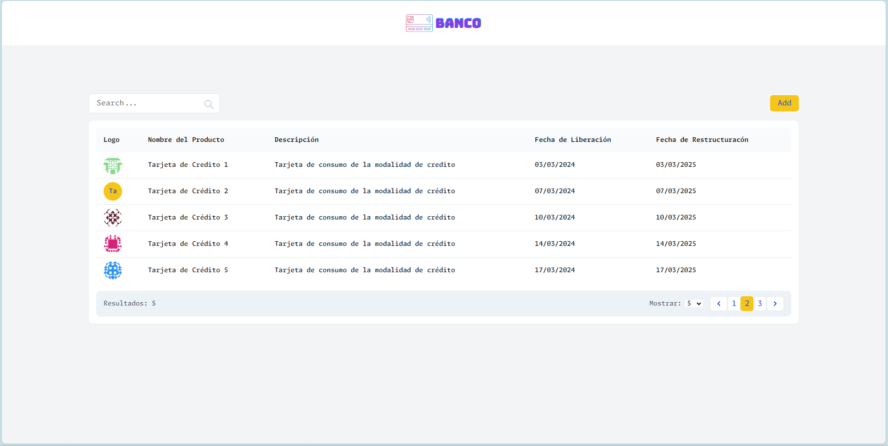
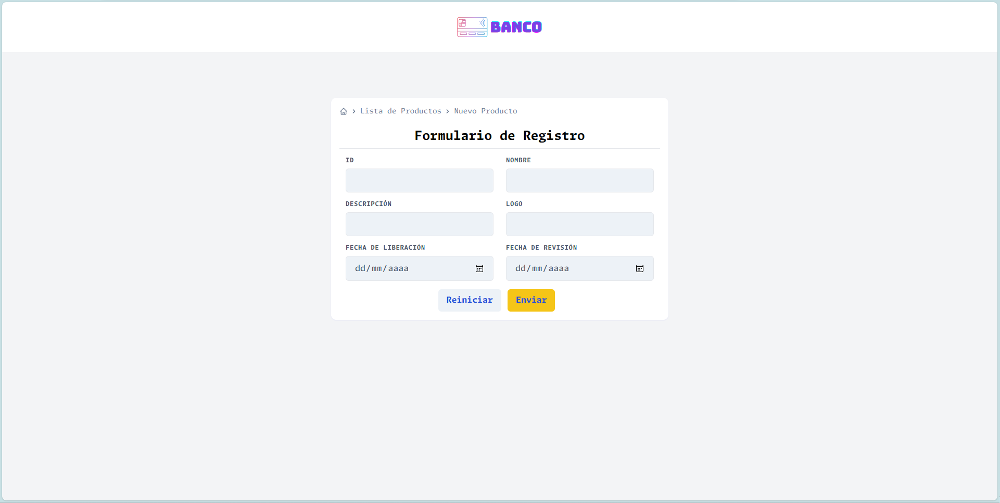

# JesusLeon

Este proyecto fue generado con [Angular CLI](https://github.com/angular/angular-cli) versión 17.0.3.

## Servidor de desarrollo

Ejecuta `ng serve` para un servidor de desarrollo. Navega a `http://localhost:4200/`. La aplicación se recargará automáticamente si cambias alguno de los archivos fuente.

## Generación de código

Ejecuta `ng generate component nombre-componente` para generar un nuevo componente. También puedes usar `ng generate directive|pipe|service|class|guard|interface|enum|module`.

## Construcción

Ejecuta `ng build` para construir el proyecto. Los artefactos de construcción se almacenarán en el directorio `dist/`.

## Ejecución de pruebas unitarias

Ejecuta `ng test` para ejecutar las pruebas unitarias a través de [Karma](https://karma-runner.github.io).

## Ejecución de pruebas de extremo a extremo

Ejecuta `ng e2e` para ejecutar las pruebas de extremo a extremo a través de una plataforma de tu elección. Para usar este comando, primero necesitas agregar un paquete que implemente capacidades de prueba de extremo a extremo.

## Ayuda adicional

Para obtener más ayuda sobre Angular CLI, usa `ng help` o consulta la [Página de Referencia y Resumen de Comandos de Angular CLI](https://angular.io/cli).

## Lista de productos

Este proyecto incluye una lista de productos. Cada producto tiene un nombre, una descripción y las fechas de liberacion y restructuración. Puedes agregar un producto a la lista utilizando el formulario de agregar producto.

## Agregar producto

Para agregar un producto, llena el formulario de agregar producto y haz clic en el botón de Enviar. El producto se añadirá a la lista y se mostrará en la página principal.

